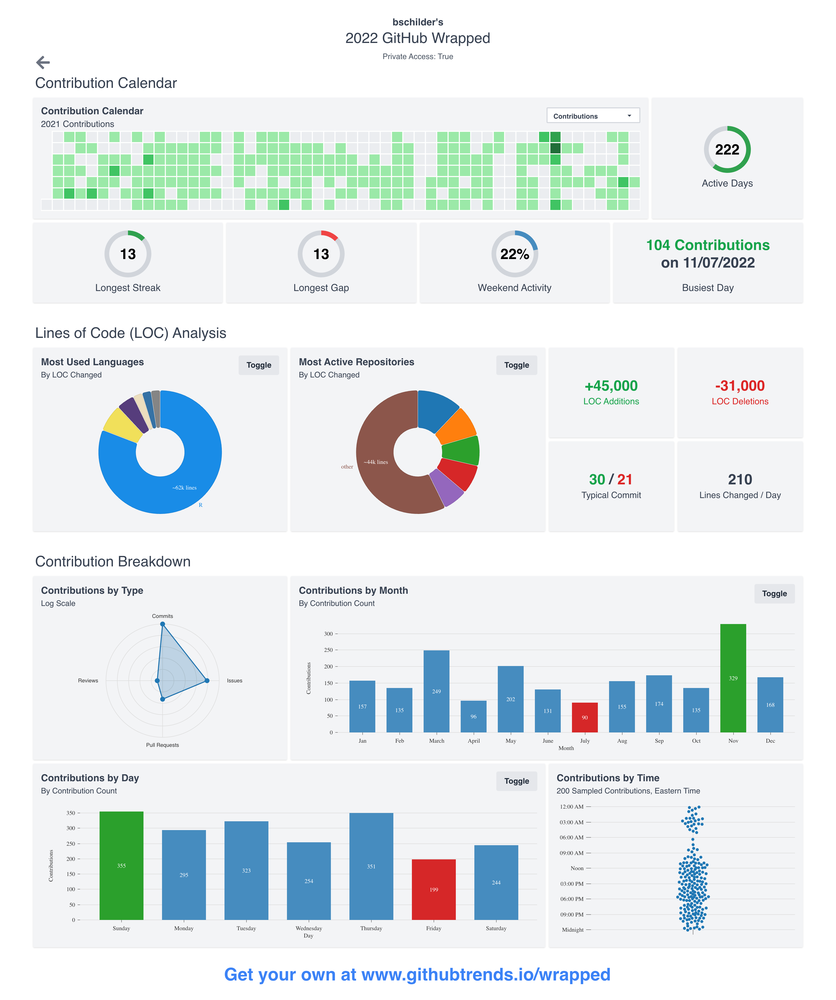

```{r setup, include=FALSE}
knitr::opts_chunk$set(echo = FALSE)
```

<p align="left">
    <a href="https://www.linkedin.com/in/brian-schilder"></a>
</p>

## [Curriculum Vitae](https://bschilder.github.io/CV/CV.html)

<a href="https://bschilder.github.io/CV/CV.html">

</a>


## [Professional Website](https://bschilder.github.io/BMSchilder)

<a href="https://bschilder.github.io/BMSchilder/">

</a>


------------------------------------------------------------------------

## GitHub Stats

### Summary

<a href="https://githubtrends.io">
    
</a> <a href="https://githubtrends.io">
    
</a>

### Full Report
<details>
<summary>📋</summary>
<!-- https://api.githubtrends.io/wrapped/bschilder -->
</a> <a href="https://www.githubtrends.io/wrapped/bschilder">
    
</a>
</details>


## Projects 

A list of software, databases, websites, and other projects that I've
created or made significant contributions to.

### R Packages


### All Projects

```{r, attr.output='style="max-height: 100px;"'}
data.table::fread("~/Desktop/CV/cv_data/tools.csv") |>
    knitr::kable()
    
```
